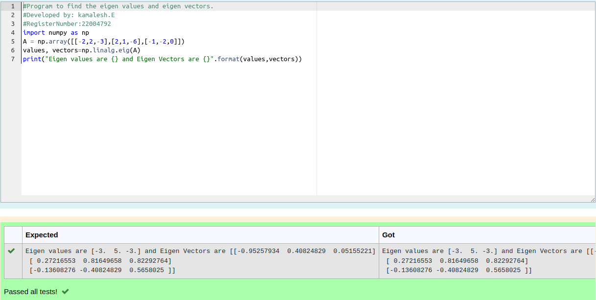

# EIGENVALUES-AND-EIGENVECTORS
## Aim:
To write a python program to find the Eigenvalues and Eigen Vectors
## Equipment’s required:
1. 	Hardware – PCs
2. 	Anaconda – Python 3.7 Installation / Moodle-Code Runner
## Algorithm:
### Step1 : 
Import numpy as np.
### Step 2: 
Assign np.array() in inverse of a matrix.
### Step 3: 
Using the np.linalg.eig(),  we get two results (first is eigenvalue and second is eigenvector) of the given matrix.
### Step 4: 
Add the coding and end the program.

## Program:
```
#Program to find the eigen values and eigen vectors.
#Developed by: kamalesh.E
#RegisterNumber:22004792
import numpy as np
A=np.array([[-2,2,-3],[2,1,-6],[-1,-2,0]])
b,c=np.linalg.eig(A)
print ("Eigen values are",b,"and Eigen Vectors are",c)
```
## Output:


## Result:
Thus the Eigenvalue and Eigenvector is successfully solved using python program
